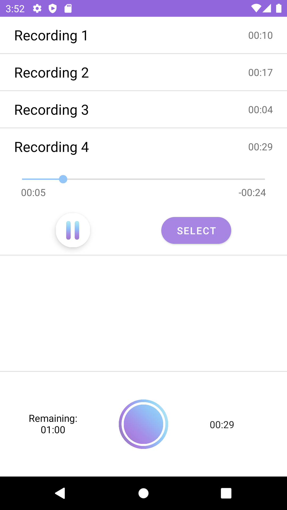

# Blindly

Blindly is a dating application designed to meet new people. But what really makes it stands out, is that no pictures are allowed here. 
At Blindly we believe that love is blind. We value deep meaningful connections. That’s why you’ll use your beautiful voice to present yourself to the world!
Once you've found your match, you will be able to communicate with them in the integrated chat and plan for a date.  

## Features:

### Login
 

### Setup your account
If you login for the first time, you will be able to setup your account to your preferences (name, gender, etc.) and record your first audio.

  

### Match
Swipe right when yoy hear someone you like, swipe left otherwise.

 

### Your matches
We grouped all the person you've matched with in the same place, this way you'll be able to easily find them, have a closer look at their profile, see what they like,
talk to them, and once you've plan a date, easily find them in real life thanks to a map that shows the location of both participants (if they are logged in).

    

### Plan a date
The weather is directly accessible from the app, so you can plan for the most perfect date and not forget about it by directly creating an event in your calendar!

  

### Profile
Edit your informations and preferences, so that potential matches we present you with may fit your expectations better.

  

## Configuration:
The first two steps are required for the app to work (the login and the OpenWeather API key), the third one is optional.

### Login 
To login into our app, we need to add the Debug variant of your SHA1 into the Firebase console of our project. To do this, go into the folder where the project has been cloned
and open a terminal, enter:
./gradlew signingReport

### OpenWeather API Key
You'll first need to generate an OpenWeather API key. In the local.properties file at the root of the folder add the following line:
OPEN_WEATHER_MAP_KEY="YOUR_API_KEY"

### Facebook login (optional)
If you wish to login with Facebook you will have to follow the step 6 of the [Facebook Login for Android - Quickstart](https://developers.facebook.com/docs/facebook-login/android)
 

